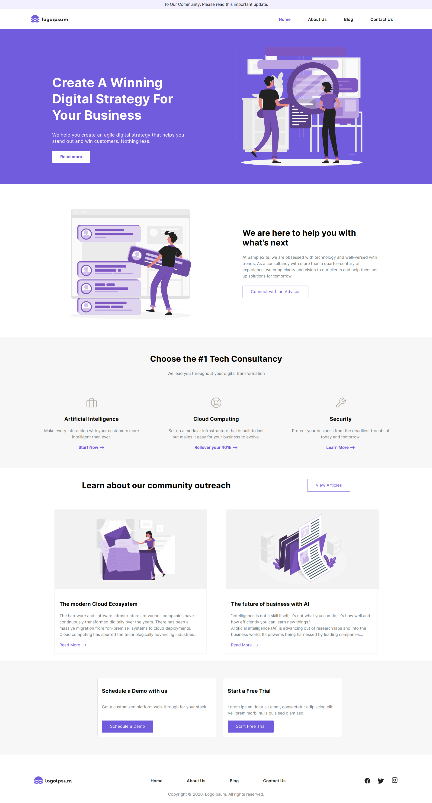

# Build a Starter Website with .Net and Contentstack

About Contentstack: Contentstack is a headless CMS with an API-first approach that puts content at the centre. It is designed to simplify the process of publication by separating code from content.

About this project: Blazor is a feature of ASP.NET, the popular web development framework that extends the .NET developer platform with tools and libraries for building web apps. This guide will help you create a starter marketing website built using the ASP.NET Blazor with minimal steps.

## Live Demo

You can check the [live demo](http://contentstack-dotnet-starterapp.herokuapp.com/) to get first-hand experience of the website.

## Tutorial

We have created an in-depth tutorial on how you can create a Blazor starter website using Contentstack’s .Net SDK and fetch its content from Contentstack.

[Build Website using .Net and Contentstack](https://www.contentstack.com/docs/developers/sample-apps/build-a-starter-website-using-asp-net-blazor-and-contentstack-net-sdk/)

**More Resources**

Read Contentstack [docs](https://www.contentstack.com/docs/)

Learn about [ASP.Net Blazor](https://dotnet.microsoft.com/apps/aspnet/web-apps/blazor)
